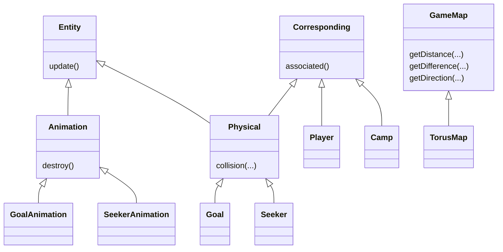

<div align="center">
    <h1>Seekers Server</h1>
	<a href="https://jitpack.io/#seekers-dev/seekers-server">
		
	</a>
    <a href="https://github.com/seekers-dev/seekers-java/actions/workflows/github-code-scanning/codeql">
        
    </a>
    <a href="https://github.com/seekers-dev/seekers-java/actions/workflows/dependency-review.yml">
        
    </a>
    <a href="https://github.com/seekers-dev/seekers-java/actions/workflows/maven.yml">
        
    </a>
    
    
    
</div>

In seekers, AIs compete against each other with the aim of scoring as many points as possible. This project is competition-oriented for students.

## Getting started

Please note that at least java 11 is required.

### Installation

Get a jar file from the latest release or build it on your own.

#### Build it on your own

First get this repo locally. You can download the zip file or fork and clone it. You can build the jar with the following command:

```shell
bash mvnw install
```

That's it! You can find the jar file in the `target` folder. Please note that for execution you will need the file with
the uber classifier.

### Run it

You can run the jar file with the following command:

```shell
java -jar seekers-server-*.*.*.jar
```

If you start the server for the first time, the following file and folders will be created:

|    Folder    | Purpose                               |
|:------------:|---------------------------------------|
| `config.ini` | Config file for changing the settings |
|  `players`   | Bot files from the players            |
|  `drivers`   | Store local drivers                   |
|  `results`   | Save tournament results               |

Before the server starts, the app checks first if all listed paths exist. If a path does not exist, it will be created.
Then it will launch all plugins. It will create a tournament with a list of matches. In the tournament will every player
play a match against every other opponent.

## Config

In the `config.ini`, you can set properties for the game and your drivers.
Please note that the config file of the seekers-py repo and this config file are interchangeable. If you
have already altered your config file for python, you can simply reuse it for the server.

Please note that the `playtime` is measured in game ticks. For a conversion between ticks and time, you can look at the
table below for a `tick-duration` of $10.0$:

|   Ticks    | Time  |
|:----------:|:-----:|
|     1      | 10ms  |
|    100     |  1s   |
|    6000    | 1min  |
|   30000    | 5min  |
|   90000    | 15min |
|   360000   |  1h   |
|  8640000   |  1d   |
| 3155760000 |  1a   |

The tick duration is measured in milliseconds. To calculate the duration of any match $t$ in minutes based on the tick duration $\Delta t$ and playtime $p$, you can use the following formula:

$$t=\frac{p \cdot \Delta t}{60\cdot1000}$$

## Players

The server will create a tournament with all AIs that are in the `players` folder. A file is marked as a valid player
if it starts with `ai`. Drop all files you want to run into this folder and start the server. Please note that an empty
folder will result into an empty tournament. If the tournament is empty, the server will be closed automatically.

## Results

All results will be saved in the ``results`` folder. This file contains a list of all matches that are still running and
a map of all results for the players. Every player has a list of all the points that it received in the respective
match.

```json
{
  "matches": [
    ["players/ai-x\u003dx+1.py", "players/ai-triumvirat.py"],
    ["players/ai-undefined.py", "players/ai-triumvirat.py"]
  ],
  "results": {
    "players/ai-x\u003dx+1": [0], 
    "players/ai-undefined":[0]
  }
}
```

## Structure

This is the class diagram of important types in this program:

