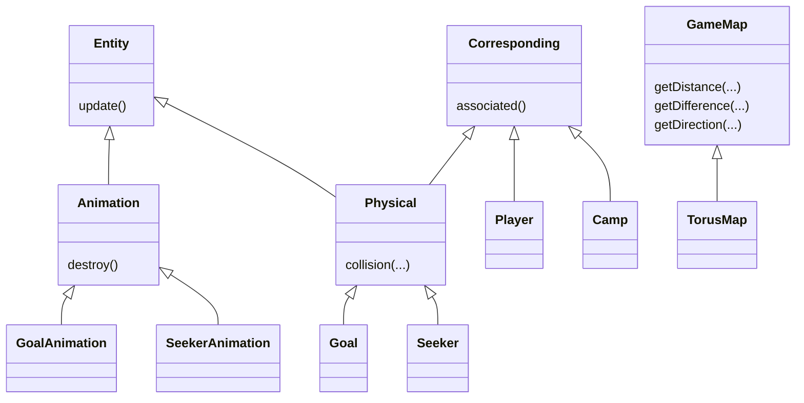

<h1 align="center">Seekers Server</h1>

<p align="center">
	<a href="https://jitpack.io/#seekers-dev/seekers-server">
		
	</a>
    <a href="https://github.com/seekers-dev/seekers-java/actions/workflows/github-code-scanning/codeql">
        
    </a>
    <a href="https://github.com/seekers-dev/seekers-java/actions/workflows/dependency-review.yml">
        
    </a>
    <a href="https://github.com/seekers-dev/seekers-java/actions/workflows/maven.yml">
        
    </a>
    
    
    
</p>

In seekers, AIs compete against each other with the aim of scoring as many points as possible. This project is competition-oriented for students.

## Getting started

Please note that at least java 11 is required.

### Installation

Get a jar file from the release or build it on your own.

#### From release

There is currently no official release available, however you can check out [Jitpack](https://jitpack.io/#seekers-dev/seekers-server)
for snapshot builds.

#### Build it on your own

First get this repo locally. You can download the zip file or fork and clone it. You can build the jar with the following command:

```shell
bash mvnw install
```

That's it! You can find the jar file in the `target` folder. Please note that for execution you will need the file with
the uber classifier.

### Run it

You can run the jar file with the following command:

```shell
java -jar seekers-server-*.*.*.jar
```

If you start the server for the first time, the following file and folders will be created:

|    Folder    | Purpose                               |
|:------------:|---------------------------------------|
| `config.ini` | Config file for changing the settings |
|  `players`   | Bot files from the players            |
|  `plugins`   | Loading plugin jar files              |
|  `results`   | Save tournament results               |

Before the server starts, the app checks first if all listed paths exist. If a path does not exist, it will be created.
Then it will launch all plugins. 

## Config

In the `config.ini`, you can set properties for the game and your plugins. Note that all plugins have their own section.
For example, the section of the python plugin is `[python-plugin]`. The name of the section is equivalent to the id of
the plugin. Please note that the config file of the seekers-py repo and this config file are interchangeable. If you
have already altered your config file for python, you can simply reuse it for the server.

## Players

## Plugins

## Results

## Structure

This is the class diagram of important types in this program:

